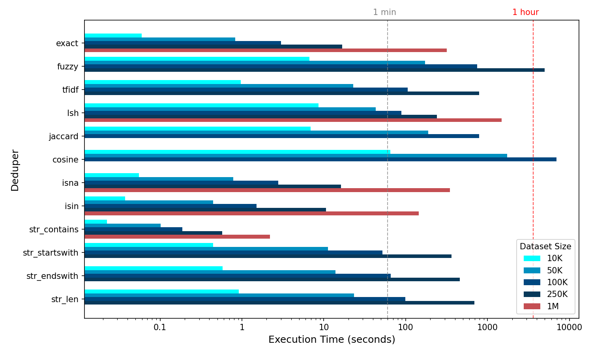
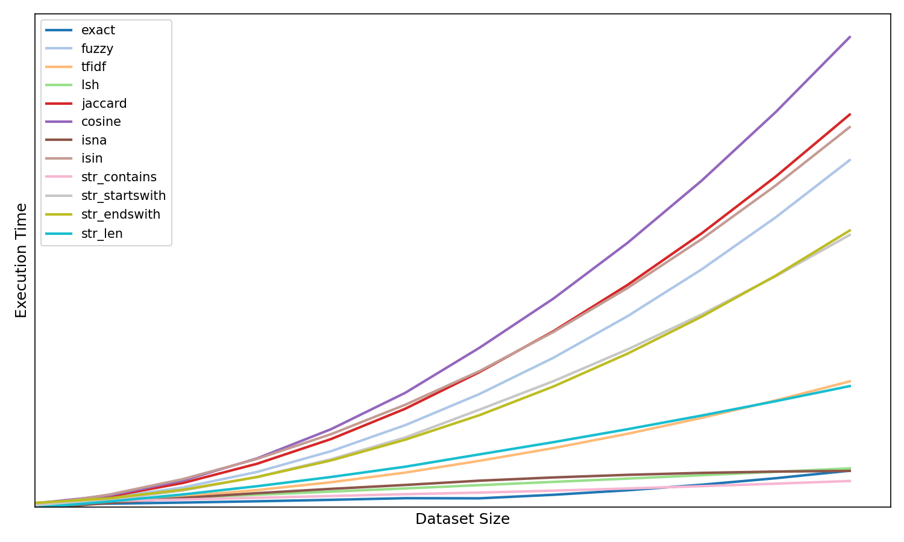

Near Deduplication is a complex, compute-intensive task. Generally speaking, deduplication scales as *O(n^2^)*, as any given record has to be looked up against every other record. Below we benchmark **Liken's** dedupers, investigate their scaling properties, and discuss three techniques to make deduplication scale more efficiently.

## Measuring Performance

### Benchmarking

Benchmarked performance is summarised in the below graphic. Dedupers are operated on nominally representative columns of data that might typically be found in a dataset, for example, an "address" column. The below benchmark focuses on performance at the hour-mark as a general maximum. Although runtimes can vary greatly, the hour-long benchmark is a useful one. As such, some deduper's performance are not shown for larger datasets.

Benchmarking was carried out on a standard personal machine.



/// caption
Performance of **Liken's** dedupers measured as execution time against increasing dataset sizes. In instances where a dataset size caused a deduper's projected runtime to greatly exceed 1 hour, it was excluded. The single minute and hour marks are provided for orientative benchmarking. The "million-class" dedupers are highlighted in red.
///

### Scaling

Above we same the performance of **Liken's** liken's dedupers. The following graphic provides a normalized view of how the deduper's scale with complexity (dataset size).



/// caption
Computational complexity scaling of Liken's dedupers. 
///

The scaling of deduper's can be useful to provide approximate estimates of the performance of specific deduper's when not provided in the the prior performance graphic. For example, in the case of `cosine` complexity evolves as *O(n^2^)* and it can be estimated that with nominal data, doubling the dataset size from 100K to 200K would results in a four-fold execution time increase i.e. from ~2 hours to ~8 hours.

### Performance Caveats

- Individual deduper performance can be greatly affected by the average string length of a column.
- The performance of the `str_*` dedupers is highly performant when selecting patterns that exist sparesely. A generic choice of a pattern such as `'a'` in `str_contains`, for example, results in an explosive runtime increase. Pattern choices should be limited those that have a meaning, for example, `'street'` in an address column. Or, `'ltd'` in a company name column. This is similarily true for `str_len` which is fast when the selected length boundaries do not exist in the data!
- For large datasets, `lsh` is exceptionally performant. Note that for the above benchmarks it is estimated `lsh` could handle 10 million rows in single digit hours, on a standard personal machine.

## Optimising Performance

### Use Pipelines

[Pipelines](../tutorials/applying-dedupers.md#pipelines-of-dedupers) make ideal use cases for using [predicate dedupers](../tutorials/first-steps.md#built-in-dedupers), given the number of use cases that motivate AND semantics. When using predicate dedupers in a pipeline, **Liken** implements predicate pushdown. Let's look at what that means by using an example based on the following dummy data:

id| address                  | email
--|--------------------------|-------
1 | None                     | random.company@yahoo.com
2 | None                     | legit.holdings@msn.dk
3 | 43 queensbridge, n99 6lt | extreme.trees@plants.co.uk
4 | 65 lindberg way, 90345   | extreme.trees@plants.co.uk

/// caption
///

Deduplicating this data on the "email" column with an exact deduper could be implemented like:

``` python
df = (
    lk.dedupe(df)
    .apply(lk.pipeline().step(lk.col("email").exact()))
    .drop_duplicates()
)
```

In such a case, **Liken** would loop through all 4 email records and identify the last 2 as duplicates. But, you may be well placed to "qualify" your deduplication step with a predicate deduper, using AND semantics. This might be that you only want to consider "email" instances as valid for deduplication if the "address" column is itself not null (as seen in the data):

``` python
df = (
    lk.dedupe(df)
    .apply(
        lk.pipeline().step(
            [
                lk.col("email").exact(),
                ~lk.col("address").isna(),
            ]
        )
    )
    .drop_duplicates()
)
```

In this case, with predicate pushdown the exact deduper will only loop through the instances of records where the "address" column is not null, in this case only 2 records — this can result in a significant performance boost because the predicate deduper operates first at approximately *O(n)*, returning *n'*, where *n' < n*. It's always useful to try to qualify a similarity deduper with a predicate deduper using AND semantics, especially if performance is an issue and the logic is well motivated from a logical point of view. Regardless of the above two cases, with our dummy data, the deduplicated data looks the same:

id| address                  | email
--|--------------------------|-------
1 | None                     | random.company@yahoo.com
2 | None                     | legit.holdings@msn.dk
3 | 43 queensbridge, n99 6lt | extreme.trees@plants.co.uk

/// caption
///

### Use the LSH deduper

The LSH deduper is faster than *O(n^2^)* (but slower than *O(n)*). In fact it is approximately *O(nk)* where *k << n*. LSH, however, requires extensive testing and must be tuned.

As noted in the above [benchmarks](../in-practice/performance.md#benchmarking), LSH can easily scale to huge datasets.

### Use Partitioned Data

**Liken** [supports the use of PySpark](../tutorials/first-steps.md#instantiating). **Liken** is re-instantiatedin every Spark worker node, where each worker node recieves a partition. You can achieve this by reading in an already partitioned dataset, or by re-partitioning a dataset.

!!! Note
    Re-partitioning in for deduplication workloads often makes use of a "Blocking Key". A blocking key is generated in the dataset and each partition is chosen based on the value of a blocking key. This is especially useful when we know that duplicates are never (or very unlikely) going to be found *across* blocking keys. As an example, the blocking key could be the first letter of a customer's name. This can then be used to divide (partition) a dataset into more manageable chunks that are already related by an inherently meaningful feature.


