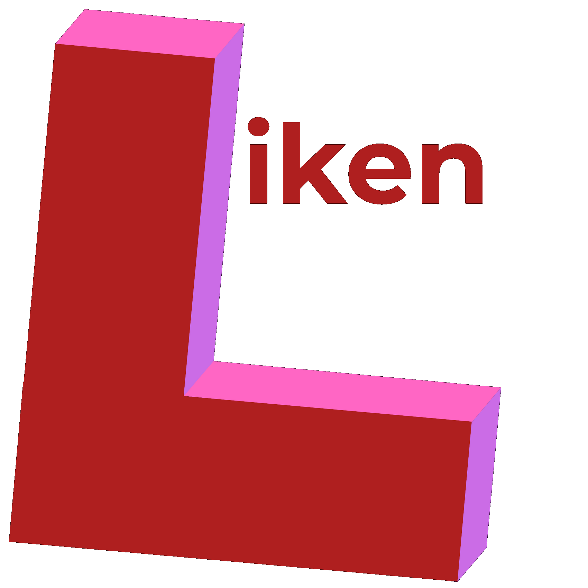

<!-- ---
title: Liken
--- -->

<style>
.md-content .md-typeset h1 { display: none; }
</style>

<p align="center">
  <a href="https://victoraut.github.io/liken/"></a>
</p>

***
**Source Code**: [https://github.com/VictorAut/liken](https://github.com/VictorAut/liken)

***

**Liken** is a library providing enhanced deduplication tooling for DataFrames.

The key features are:

- Near deduplication
- Ready-to-use deduplication strategies
- Record linkage and canonicalization
- Rules-based deduplication
- Pandas, Polars and PySpark support
- Customizable in pure Python

## Installation

```shell
pip install liken
```

## Use `liken` In Your Code

```python {hl_lines="1 6 7"}
from liken import Dedupe
import pandas as pd

df = pd.DataFrame(columns = ["name"], data = [...])

lk = Dedupe(df)
df = lk.drop_duplicates()
```


## Licence

**Liken** is licensed under the [Apache-2.0 License](https://www.apache.org/licenses/LICENSE-2.0.html). See the [LICENSE](https://github.com/VictorAut/liken/blob/main/LICENSE) file for more details.