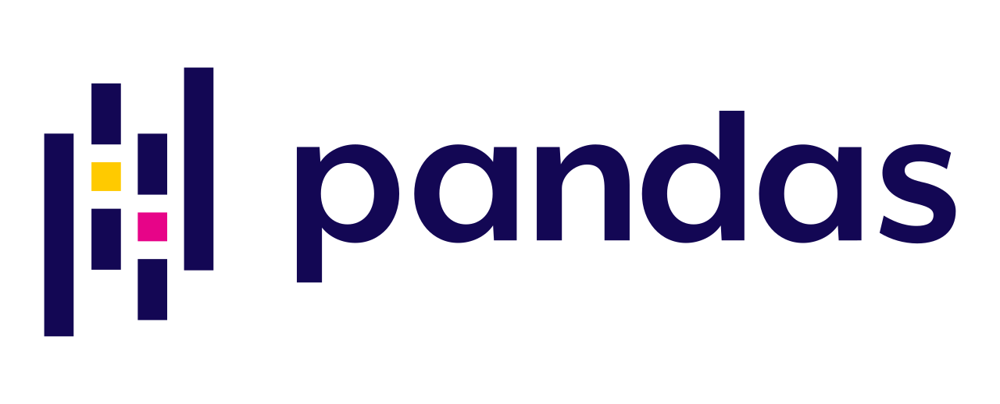
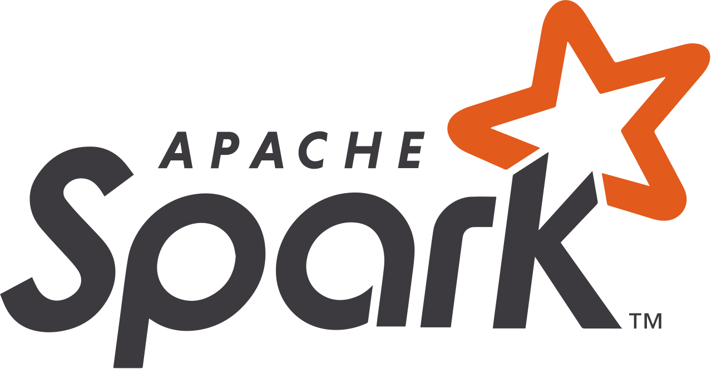

<style>
.md-content .md-typeset h1 { display: none; }
</style>

<p align="center">
  <a href="https://victoraut.github.io/liken/">
    
    
  </a>
</p>

<p align="center">
<a href="https://pypi.python.org/pypi/liken"></a>


</p>


***
**Source Code**: [https://github.com/VictorAut/liken](https://github.com/VictorAut/liken)
***

<div class="liken-definition">
  <em>Liken</em>:<br>
  <small><i>phrasal verb</i></small><br>
  <small>/ˈlaɪ.kən/</small><br>
  <strong>to say that something is similar to or has the same qualities as something else</strong>
</div>

## Why...

**Liken** provides enhanced deduplication tooling for DataFrames.

The key features are:

- Near deduplication tooling
- Fuzzy string matching deduper
- TF-IDF tokenization deduper
- LSH tokenization deduper
- Jaccard set deduper
- Cosine set deduper
- Composable, rules-based, deduplication pipelines
- Predicate dedupers for rules
- Record linkage and canonicalization
- Built-in Preprocessors
- Pandas, Polars, Modin, Ray and PySpark support
- Customizable in pure Python
- Synthetic record creation
- Easy to understand syntax
- Dummy datasets for practice

**Liken** aims to answer the call for as-easy-to-use near deduplication as possible, with as natural and easy to understand syntax as possible.

Cut boilerplate code to simple deduplication pipelines with **Liken**.

## Supported DataFrame Libraries

<div class="logo-grid">
  <a href="https://pandas.pydata.org" target="_blank">
    
  </a>

  <a href="https://pola.rs" target="_blank">
    
  </a>

  <a href="https://modin.readthedocs.io/en/latest/" target="_blank">
    
  </a>

  <a href="https://spark.apache.org/docs/latest/api/python/" target="_blank">
    
  </a>

  <a href="https://docs.ray.io/en/latest/" target="_blank">
    
  </a>

  <a href="https://docs.ray.io/en/latest/" target="_blank">
    
  </a>

</div>


## Installation

<!-- termynal -->
```
$ pip install liken
---> 100%
```

## Pandas Affordances

**Liken's** focus is on composable, complex, deduplication pipelines that scale to distributed datasets. But, extra-easy integration is provided for Pandas DataFrames. 

If you are a pandas user looking for intuitive near-deduplication Pandas API extension and little more, head to the [Coming from Pandas](tutorials/applying-dedupers.md#coming-from-pandas) section!


## Use `liken` In Your Code

```python
import liken as lk

df = ... # e.g. read data

df = (
    lk.dedupe(df)
    .apply(lk.fuzzy())
    .drop_duplicates("name")
)
```


## License

**Liken** is licensed under the [Apache-2.0 License](https://www.apache.org/licenses/LICENSE-2.0.html). See the [LICENSE](https://github.com/VictorAut/liken/blob/main/LICENSE) file for more details.