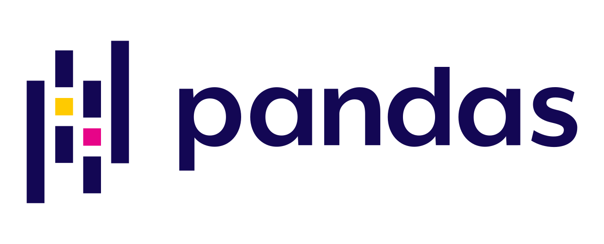
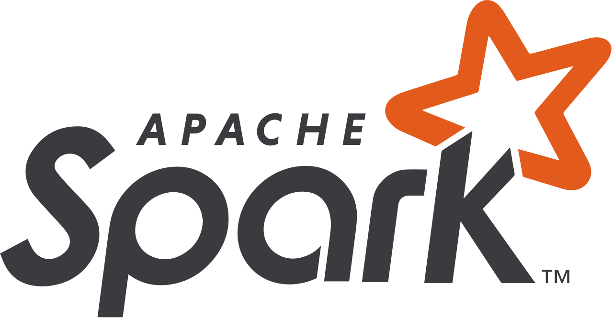

<style>
.md-content .md-typeset h1 { display: none; }
</style>

<p align="center">
  <a href="https://victoraut.github.io/liken/">
    
    
  </a>
</p>

<p align="center">
<a href="https://pypi.python.org/pypi/liken"></a>


</p>


***
**Source Code**: [https://github.com/VictorAut/liken](https://github.com/VictorAut/liken)
***

<div class="liken-definition">
  <em>Liken</em>:<br>
  <small><i>phrasal verb</i></small><br>
  <small>/ˈlaɪ.kən/</small><br>
  <strong>to say that something is similar to or has the same qualities as something else</strong>
</div>

## Why...

**Liken** deduplicates DataFrames, resolves entities and canonicalizes records. One syntax covers pandas on a laptop and PySpark in production.

### Features

The key features are:

- Near deduplication tooling
- Exploratory duplicate-rate profiling
- Fuzzy string matching deduper
- TF-IDF tokenization deduper
- LSH tokenization deduper
- Jaccard set deduper
- Cosine set deduper
- Pandas API extension
- Composable, rules-based, deduplication pipelines
- Predicate dedupers for rules
- Record linkage and canonicalization
- Built-in Preprocessors
- Pandas, Polars, Modin, Ray, Dask and PySpark support
- Customizable in pure Python
- Synthetic record creation
- Easy to understand syntax
- Dummy datasets for practice

**Liken** makes near deduplication as approachable as exact deduplication. Describe the rules, apply them, and get deduplicated or canonicalized DataFrames back.

### Use Cases

- **Find near-duplicate records.** Catch what exact matching misses — spelling variants, formatting drift, typos — with fuzzy and token dedupers.
- **Link records that describe the same entity.** Combine datasets and label duplicates across the lot with configurable matching rules instead of exact keys — `canonicalize()` keeps every record and gives each duplicate group a shared id.
- **Canonicalize duplicate groups.** Collapse each group of duplicates to a single row and keep a canonical id on every record.
- **Build golden records.** Consolidate each duplicate group into one synthetic record with `synthesize()`.
- **Explore duplicate rates first.** Profile how much duplication each column carries, per threshold, with `explore()` before committing to rules.

## Supported DataFrame Libraries

<div class="logo-grid">
  <a href="https://pandas.pydata.org" target="_blank">
    
  </a>

  <a href="https://pola.rs" target="_blank">
    
  </a>

  <a href="https://modin.readthedocs.io/en/latest/" target="_blank">
    
  </a>

  <a href="https://spark.apache.org/docs/latest/api/python/" target="_blank">
    
  </a>

  <a href="https://docs.ray.io/en/latest/" target="_blank">
    
  </a>

  <a href="https://docs.dask.org/en/latest/" target="_blank">
    
  </a>

</div>


## Installation

Install with `pip`:

```bash
pip install liken
```

Install with `uv`:

```bash
uv pip install liken
```

### Extras

**Liken** supports `pandas` and `polars` in the default installation. **Liken** also supports [multiple other DataFrame libraries](./index.md#supported-dataframe-libraries), install them optionally:

=== "pip"

    ```bash
    pip install 'liken[dask]'     # deduplicate dask dataframes
    pip install 'liken[modin]'    # deduplicate modin dataframes
    pip install 'liken[ray]'      # deduplicate ray datasets
    pip install 'liken[pyspark]'  # deduplicate pyspark dataframes
    pip install 'liken[all]'      # deduplicate with any of the above
    ```

=== "uv"

    ```bash
    uv pip install 'liken[dask]'    # deduplicate dask dataframes
    uv pip install 'liken[modin]'   # deduplicate modin dataframes
    uv pip install 'liken[ray]'     # deduplicate ray datasets
    uv pip install 'liken[pyspark]' # deduplicate pyspark dataframes
    uv pip install 'liken[all]'     # deduplicate with any of the above
    ```

??? tip "Installing in a Python project"
    It's recommended you set up a project with [uv](https://docs.astral.sh/uv/getting-started/installation/).

    Install uv, create a project, and install **Liken**:

    ```bash
    uv init my-project
    cd my-project
    uv add liken
    ```

    Use `uv add` to automatically install **Liken** within a new virtual environment, and tracked as a dependency in `pyproject.toml`.

## Use `liken` In Your Code

```python
import liken as lk

# df = ... # e.g. read data

df = (
    lk.dedupe(df)
    .apply(lk.fuzzy(threshold=0.7))
    .drop_duplicates("name")
)
```

Jump to the [tutorial](tutorials/first-steps.md) to dive deeper into how to build incrementally complex pipelines.

### Pandas Affordances

**Liken's** focus is on composable deduplication pipelines that scale to distributed datasets. Pandas users who want intuitive near-deduplication as a pandas API extension get a dedicated entry point: head to the [Coming from Pandas?](tutorials/applying-dedupers.md#coming-from-pandas) section!

## AI Agent Skills

**Liken** makes available agent skills for use in agentic workflows. This is an optional inclusion to your project, and will help you navigate the various APIs so as to best help you solve your problem.

Install the bundle from the [tessl](https://tessl.io/registry/victoraut/liken-skills) registry:

```bash
tessl install victoraut/liken-skills
```

The bundle contains one skill per API tier:

| Skill | Teaches |
| ----- | ----- |
| `liken` | Overview, and which API to reach for |
| `liken-dedupers` | Applying built-in dedupers |
| `liken-pipelines` | Pipelines with AND/OR/NOT rules and built-in preprocessors |
| `liken-custom-dedupers` | Writing your own dedupers in pure Python |
| `liken-record-linkage` | Canonicalization and synthetic records |
| `liken-backends-performance` | Backend selection, scaling and performance |

??? info "Using the skills"
    Once installed, agent-skill-aware tools (Claude Code, Cursor, and others) discover the skills automatically and load the relevant one on demand. Pin a version for reproducibility, e.g. `tessl install victoraut/liken-skills@0.1.0`. See the [tessl documentation](https://docs.tessl.io) for managing installed skills.

## License

**Liken** is licensed under the [Apache-2.0 License](https://www.apache.org/licenses/LICENSE-2.0.html). See the [LICENSE](https://github.com/VictorAut/liken/blob/main/LICENSE) file for more details.
