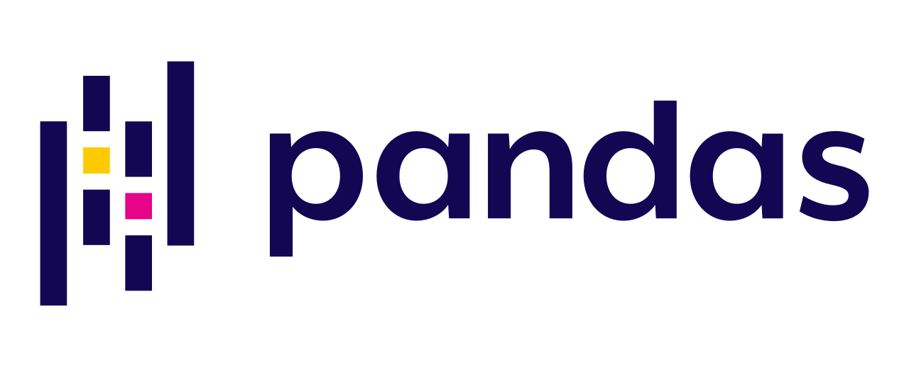
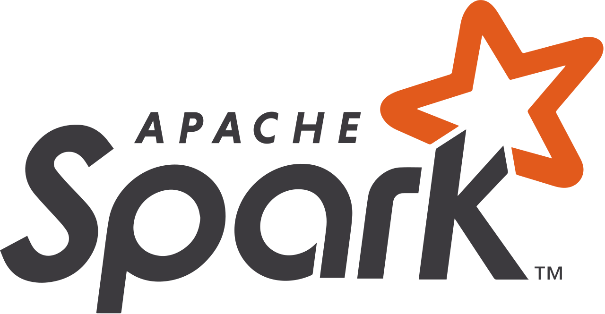

  

***
**Source Code**: [https://github.com/VictorAut/liken](https://github.com/VictorAut/liken)
***

## Why...

Liken deduplicates DataFrames, resolves entities and canonicalizes records.

### Features

The key features are:

- Near deduplication tooling
- Exploratory duplicate-rate profiling
- Fuzzy string matching deduper
- TF-IDF tokenization deduper
- LSH tokenization deduper
- Jaccard set deduper
- Cosine set deduper
- Pandas API extension
- Composable, rules-based, deduplication pipelines
- Predicate dedupers for rules
- Record linkage and canonicalization
- Built-in Preprocessors
- Pandas, Polars, Modin, Ray, Dask and PySpark support
- Customizable in pure Python
- Synthetic record creation
- Easy to understand syntax
- Dummy datasets for practice

Liken makes near deduplication as approachable as exact deduplication. Describe the rules, apply them, and get deduplicated or canonicalized DataFrames back.

### Use Cases

- **Find near-duplicate records.** Catch what exact matching misses.
- **Link records that describe the same entity.** Combine datasets and label duplicates with configurable matching rules instead of exact keys.
- **Canonicalize duplicate groups.** Collapse each group of duplicates to a single row and keep a canonical id on every record.
- **Build golden records.** Consolidate each duplicate group into one synthetic, "golden", record.
- **Explore duplicate rates first.** Profile how much duplication each column carries.

## Supported DataFrame Libraries

  

  

  

  

  

  

  

### Pandas Affordances

Liken's focus is on composable deduplication pipelines that scale to distributed datasets. Pandas users who want intuitive near-deduplication as a pandas API extension get a dedicated entry point: head to the [Coming from Pandas?](tutorials/applying-dedupers.md#coming-from-pandas) section!

## License

Liken is licensed under the [Apache-2.0 License](https://www.apache.org/licenses/LICENSE-2.0.html). See the [LICENSE](https://github.com/VictorAut/liken/blob/main/LICENSE) file for more details.
